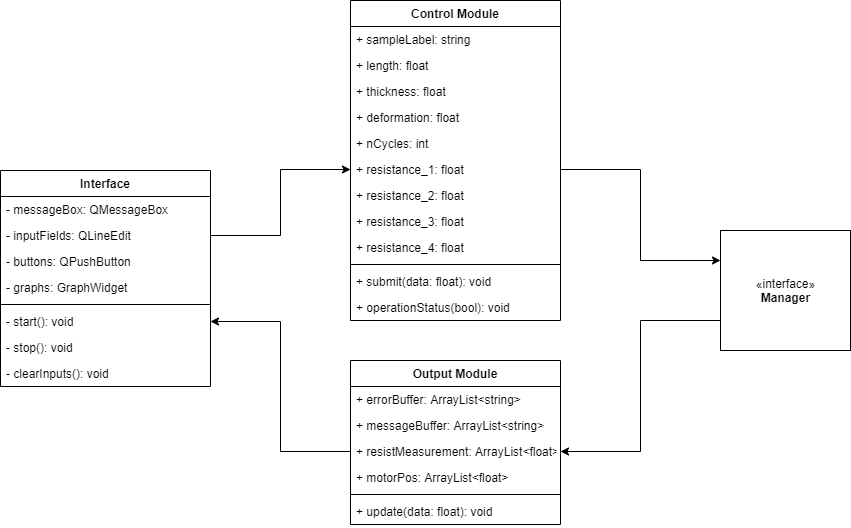

## GUI

The gui consists of 3 modules: the interface, control and output

-   The interface is what is displayed on the screen and controls the user interactions of the interface. It is built using [PyQt5](https://doc.qt.io/qtforpython/#documentation) as a framework.
-   The control module handles all inputs coming from the interface and passes them to the manager
-   The output module receives all measurements and system messages from the manager and passes them to the interface to display

    

## Interface

The layout and elements of the interface is created using QtDesigner which creates .ui file. This file is loaded when the main waindow is initialized which instantiates all the UI elements and their positions.

The graphs are displayed using a graph widget from [pyqtgraph](https://pyqtgraph.readthedocs.io/en/latest/introduction.html). The logic of the scrolling graph is taken from one of their graph scrolling [examples](https://pyqtgraph.readthedocs.io/en/latest/introduction.html#examples).

## Control and Output

The control and output modules are uni directional. Meaning that the flow of information only flows one way; towards the manager, or from the manager. They also act as a layer of abstraction between the manager and the gui. The manager (for the most part) has no idea what the interface is doing, and vice versa.

Other than passing parameters from the interface to the manager, the control module also validates the inputs against set max values before a test starts.

The output module stores the motor position and resistance data in its own buffer before passing it to the interface. It also serves as the intermmediate means of communication from the manager to the interface. So any system errors, messages, or other notifications are first stored in the output module, and the interface will constantly check for any such messages from the output.
